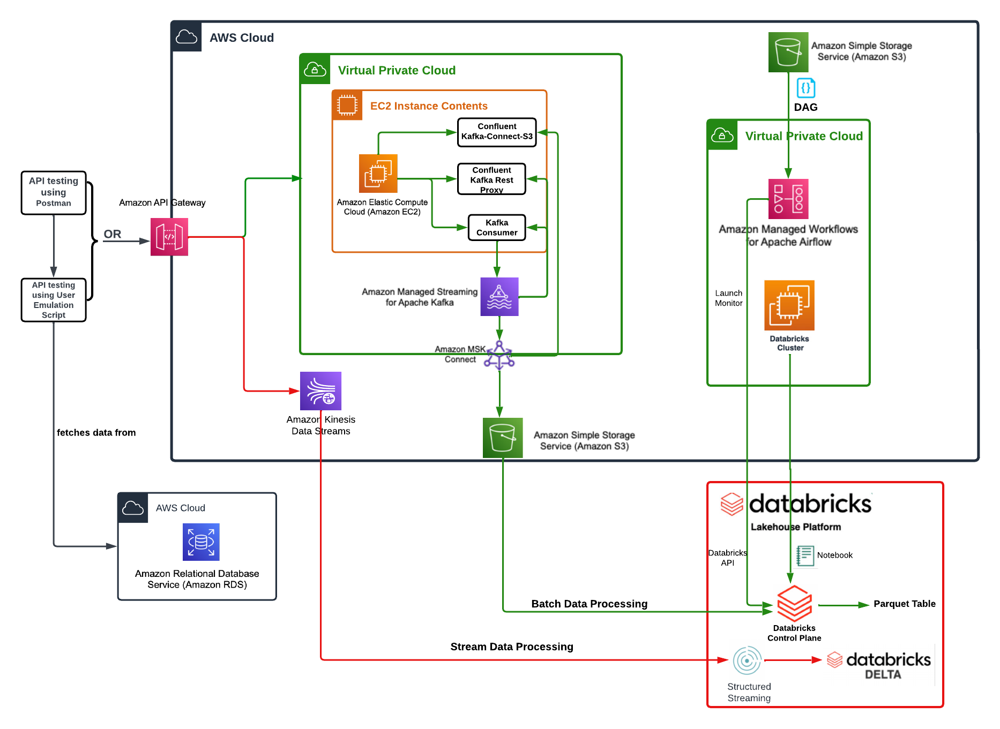

# Pinterest Data Pipeline

## Table of Contents

1. [Introduction](#introduction)
2. [Installation Instructions](#installation-instructions)
3. [Usage Instructions](#usage-instructions)
4. [File Structure](#file-structure)
5. [License Information](#license-information)

## Introduction

Pinterest crunches billions of data points every day to decide how to provide more value to their users. In this project, a similar system is created to process batch and streaming data using the AWS Cloud.

The end-to-end data pipelines looks like this:


The key tools in this project include:

- **Apache Kafka**: to analyse and streamline the Pinterest data pipeline.
- **AWS EC2**: to create an EC2 instance to handle the batch data processing workload.
- **AWS IAM**: to use IAM User authentication on the MSK Cluster for batch data, and for Kinesis access for streaming data.
- **AWS MSK**: to manage the cluster, create custom plugins and connectors for batch data.
- **Databricks**: to read, clean, query, and write batch and streaming data.
- **AWS MWAA**: to monitor the workflow of batch data-related tasks, specially in a DAG.
- **Airflow UI**: interface to monitor the workflow of the DAG for batch data.
- **AWS Kinesis**: to store and process streaming data.

In this project, we learn:

1. How to connect to AWS
2. The difference between batch and streaming data..
3. How to configure a EC2 Kafka client using an EC2 instance and an authorised IAM user to handle batch data.
4. How to connect the instance to an MSK cluster and send the batch data to an S3 bucket.
5. How to configure an API to allow batch data to be transmitted to the MSK cluster, which is then stored in the bucket.
6. How to read, clean and query the batch data in Databricks to generate insights.
7. How to create a DAG to monitor the workflow of batch data.
8. How to create streams and send streaming data using AWS Kinesis.
9. How to read, clean, and upload streaming data to Delta tables in Databricks.

## Installation Instructions

To get started with the project, first clone the repository onto your local machine.

```bash
git clone https://github.com/elishagretton/pinterest-data-pipeline744.git
cd pinterest-data-pipeline744.git/
```

## Usage Instructions

This is the final project for the Software Engineering bootcamp with AiCore.

I have been given a temporary AWS account with access to a number of paid AWS services.

To use the project and leverage paid AWS feature, find out more on the [AWS website.](https://aws.amazon.com/console/)

## File Structure

The project is structured as follows:

- **/docs**: Contains documentation files on each milestone of the project.

  - `batch-data-ec2-kafka-client-configuration.md`: Configures the EC2 instance and connects to MSK cluster for batch data.
  - `batch-data-msk-s3-connection.md`: Connects the MSK cluster to a S3 bucket for batch data to be stored.
  - `batch-data-api-configuration.md`: Configures an API in API Gateway to send batch data to Kafka topics.
  - `batch-data-processing-databricks.md`: Reads, cleans, and queries batch data in Databricks to generate insights.
  - `batch-data-workflow-management.md`: Creates and triggers a DAG to manage the workflow of tasks for the batch data.
  - `streaming-data-pipeline.md`: Creates streams and sends streaming data to AWS Kinesis. Data is then streamed to Databricks to be read, cleaned, and written to Delta tables.

- **/images**: Contains image files for documentation.

  - `CloudPinterestPipeline`: End-to-end data pipeline visualisation for batch and streaming data.
  - `batch-data-uploaded-dag.png`: Image for `batch-data-workflow-management.md`. Image of Airflow UI with uploaded DAG.
  - `batch-data-dag-status.png`: Image for `batch-data-workflow-management.md`. Image of Airflow UI with DAG status.
  - `streaming-data-kinesis-terminal.png`: Image for `streaming-data-pipeline.md`. Image of data streaming to Kinesis in terminal.
  - `streaming-data-delta-tables.png`: Image for `streaming-data-pipeline.md`. Image of sample data in Delta tables in Databricks.

- **/scripts**: Contains code files for milestone implementation and data processing.

  - **/milestones**: Contains code files for implementation of each milestone.
    - `batch-data-ec2-kafka-client-configuration.sh`: Script file for configuring a EC2 Kafka client to process batch data, discussed in `batch-data-ec2-kafka-client-configuration.md`
    - `batch-data-msk-s3-connection.sh`: Script file for connecting a MSK cluster to an S3 bucket, discussed in `batch-data-msk-s3-connection.md`
    - `batch-data-api-configuration.sh`: Script file for building an API to send batch data to Kafka topics, discussed in `batch-data-api-configuration.md`
    - `batch-data-processing-databricks.ipynb`: Databricks file for cleaning and querying batch data, discussed in more detail in `batch-data-processing-databricks.md`.
    - `streaming-data-pipeline.ipynb`: Databricks file for reading and cleaning streaming data, and writing to Delta tables, discussed in more detail in `streaming-data-pipeline.md`.
  - **/processing**:
    - `12c0d092d679-dag.py`: DAG file to orchestrate Databricks workload for batch data in AWS MWAA, discussed in `batch-data-workflow-management.md`.
    - `user_posting_emulation.py`: Python file for extracting data from a RDS database on pins, geo-location, and users, and for sending batch data to Kafka topics.
    - `user_posting_streaming.py`: Python file for extracting data from a RDS database on pins, geo-location, and users and sending the real-time streaming data to AWS Kinesis.

- **.gitignore**: Specifies files and directories to ignore in version control.

- **README.md**: Documentation file with essential information.

- **LICENSE.txt**: File containing information on MIT License used in this project.

## License Information

This project is licensed under the MIT License - see the [LICENSE.txt](LICENSE.txt) file for details.
