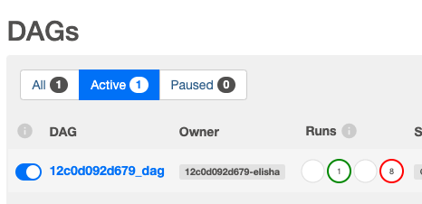
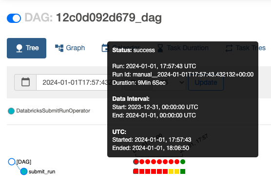

# Milestone 5: AWS MWAA

Now the data has been cleaned and queried in Databricks, we can next create a schedule of tasks (also known as **_jobs_**) to process the data.

In this milestone we learn:

- What a DAG is
- What AWS MWAA is and how to use it
- How to upload a DAG to AWS MWAA
- How to trigger a DAG using Airflow UI

To give a quick overview:

1. There are a number of jobs that need to occur to process the data.
2. The order and execution of these jobs are represented in a DAG (Directed Acyclic Graph). It's like a flowchart that shows the order in which tasks should be executed. Tasks must be completed before moving onto the following task.
3. The jobs are managed by the Databricks' Jobs API (a set of tools for developers) or the user interface (UI) to create, monitor, and manage these jobs.
4. Then, AWS MWAA is used to oversee and schedule the jobs, providing a centralized way to monitor and manage the workflow.

In summary, this setup allows you to use the powerful job orchestration capabilities of Databricks to run tasks, and AWS MWAA helps coordinate and monitor the overall workflow, providing a unified way to manage the execution of tasks organized in a DAG.

# Step 1: Set up the DAG

The DAG can be seen in the file [scripts/12c0d092d679_dag.py](../scripts/12c0d092d679_dag.py).

For this DAG, the parameters are as follows:

- `notebook_path`: path to the Databricks file created in Milestone 4 (`/Users/elishagretton@gmail.com/databricks`)
- `start_date`: the date the DAG begins (here it begins on 30/12/23, `datetime(2023, 12, 30)`)
- `schedule_interval`: the DAG is ran daily (`'@daily'`)
- `existing_cluster_id`: cluster id of Databricks cluster (`1108-162752-8okw8dgg`)

The DAG file is then loaded to the `mwaa-dags-bucket/dags/` in the S3 bucket under the name `12c0d092d679_dag`.

# Step 2: Trigger the DAG

To trigger the DAG, locate to the MWAA section of the AWS console.

On the right, click the Open Airflow UI button.

Find the DAG `12c0d092d679_dag` and click the play button.

Once the dag is running, click on the dag.

To see if the dag is running, there are little blocks of colour showing the status of the file.

Hover over the little blocks to see the status of the file. Once the status is **running** and then turns to **success**, the DAG has successfully been run! Just like this:

If the status fails, click on the red box of colour at the bottom and click Logs. This will show the errors.

# Conclusion

Now the DAG has been created and we have used a bit of Airflow UI.

In the next milestone, we will set up AWS Kinesis to send streaming data to Databricks.

Please see the next milestone [here.](./milestone_6.md)
