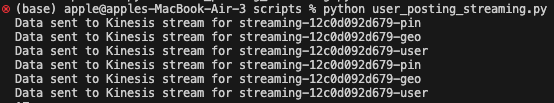
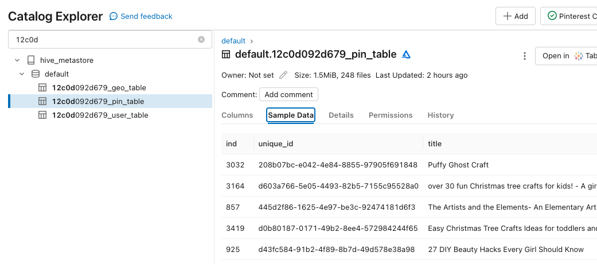

# Milestone 6: AWS Kinesis

In this milestone, we will now look at real-time streaming data. This is when there is a continuous flow of data that is generated, processed, and analysed without significant delay. The data is processed as it is generated or received, and is not stored and then processed in batch mode.

There are many positives to streaming data, for example:

- Driving data-driven decisions in real-time, providing immediate results.
- Early detection of issues.
- Quick response to events.
- Improved customer experiences.
- And many more!

In this final section, we learn:

- How to create streams in AWS Kinesis
- How to configure an API to set up streams
- How to send the pin-related data to the streams
- How to read, clean, and write the streaming data to delta tables in Databricks

## Step 1: Create streams in AWS Kinesis

AWS Kinesis is a service that collects real-time streaming data, and processes and analyses the data as soon as it arrives. This is a handy tool to gain timely analytical insights.

There are four services in AWS Kinesis. The service we use in this milestone is **AWS Kinesis Data Streaming**.

We create streams for each dataframe:

- `df_pin`: pin-related data
- `df_geo`: geo-related data
- `df_user`: user-related data.

For `df_pin`, the stream is called `streaming-12c0d092d679-pin`. The other streams are named in the same fashion.

To create the streams in AWS:

- Locate to the AWS Kinesis section
- Click `Create Stream`
- Set the name for the stream
- For the capacity mode, select `On demand`.
- Click `Create Data Stream`

Now there should be three streams for each dataframe. Currently, these streams are empty. Next, we build an API and write code to send data to these streams in real-time.

## Step 2: Configure the API with Kinesis proxy integration

Now we build an API that grants the necessary permissions for my authorised IAM role to:

- List streams in Kinesis
- Create, describe and delete streams in Kinesis
- Add records to streams in Kinesis

To do this, I followed the instructions from a notebook provided by AiCore. The instructions are long, however easy to follow from the notebook. The notebook can be viewed at this [link](https://colab.research.google.com/github/AI-Core/Content-Public/blob/main/Content/units/Cloud-and-DevOps/4.%20AWS%20Serverless%20API%20Stack/3.%20Integrating%20API%20Gateway%20with%20Kinesis/Notebook.ipynb).

## Step 3: Stream data using the API

Now to leverage the API, I created the file [user_posting_streaming.py](../scripts/processing/user_posting_streaming.py) to stream the real-time data.

In the file, I created the `send_to_kinesis(records, stream_name)` function to accept the records from the pin-related data and send the data to its corresponding stream name. The function is as follows:

```python
def send_to_kinesis(records, stream_name):
    invoke_url = f'https://t5v6ab37u9.execute-api.us-east-1.amazonaws.com/test/streams/' + stream_name + '/record/'

    payload = json.dumps({
        "StreamName": stream_name,
        "Data": records,
        "PartitionKey": str(uuid.uuid4())
    }, cls=DateTimeEncoder)

    headers = {'Content-Type': 'application/json'}

    response = requests.request("PUT", invoke_url, headers=headers, data=payload)
    if response.status_code == 200:
        print(f"Data sent to Kinesis stream for {stream_name}")
    else:
        print(f"Failed to send data to Kinesis stream for {stream_name}. Status code: {response.status_code}")
```

A thing to note about using the API to interact with the Kinesis stream, is that there is a **partition key**. As well as the data, an additional partition key is included in the payload to uniquely identify each entry.

To use the API to send data to Kinesis, the function is used in the `run_infinite_post_data_loop` to continuously stream data:

```python
send_to_kinesis(pin_result, 'streaming-12c0d092d679-pin')
send_to_kinesis(geo_result, 'streaming-12c0d092d679-geo')
send_to_kinesis(user_result, 'streaming-12c0d092d679-user')
```

Run the file in the terminal to continuously send new data to the corresponding Kinesis stream. It should look something like this:


This will run continously until you interrupt the command.

For now, leave the command running as this ensures enough data is being sent to the streams for later steps.

# Step 4: Read data in Databricks

Now the data is being sent to AWS Kinesis. We want to read, clean and write the data to Databricks.

To see the full implementation, please see the notebook [here.](../scripts/milestones/milestone_6.ipynb)

To first read the pin-related data, the necessary libraries are imported and the authentication credentials are obtained (access and secret key).

Once this is obtained, the data is read with the following code:

```python
df_pin = spark \
.readStream \
.format('kinesis') \
.option('streamName','streaming-12c0d092d679-pin') \
.option('initialPosition','earliest') \
.option('region','us-east-1') \
.option('awsAccessKey', ACCESS_KEY) \
.option('awsSecretKey', SECRET_KEY) \
.load()

df_pin = df_pin.selectExpr("CAST(data as STRING) jsonData")

# Create schema
schema = StructType([
    StructField("index", StringType(), True),
    StructField("unique_id", StringType(), True),
    StructField("title", StringType(), True),
    StructField("description", StringType(), True),
    StructField("follower_count", StringType(), True),
    StructField("poster_name", StringType(), True),
    StructField("tag_list", StringType(), True),
    StructField("is_image_or_video", StringType(), True),
    StructField("image_src", StringType(), True),
    StructField("save_location", StringType(), True),
    StructField("category", StringType(), True),
    StructField("downloaded", StringType(), True)
])
```

The same code format is used for `df_geo` and `df_user` with its corresponding stream name and own schema. A schema defines the organisation of data in the tables, which in this case, are the column names of the streamed data.

For `df_geo`, the schema includes `ind`, `country`, `latitude`, `longitude`, `timestamp`.

For `df_user`, the schema includes `date_joined`, `first_name`,`ind`, `last_name`.

I checked the contents of the data were uploaded correctly by printing the tables. It's important to keep the `user_posting_streaming.py` file running so enough data is uploaded to the tables in real-time.

# Step 5: Clean data in Databricks

For the next step, we clean the data.

When we processed the data in batches (see [Milestone 3](./milestone_3.md)), we also cleaned the data. Using the same code, we can clean the streaming data in the same way.

This can be seen in full in [milestone_6.ipynb](../scripts/milestones/milestone_6.ipynb).

The contents of the data can be printed again to check they have been cleaned correctly.

# Step 6: Write the data to Delta Tables

Now the dataframes are written to Delta Tables.

Delta tables store and manage data in a distributed environment. There are many positives such as: ensuring ACID transactions, supports batch and streaming data, and many more.

To do this for the pin-related data, the code is as follows:

```python
query = (
  df_pin
    .writeStream
    .format("delta")  # Delta Lake sink for durable storage
    .queryName("df_pin_streaming_query") # Can give the query a name
    .outputMode("append") # Append mode: Add new records to existing data
    .option("checkpointLocation", "tmp/checkpoints/pin_test")  # Add checkpoint location
    .table("12c0d092d679_pin_table")  # Specify the Delta Lake table name
)
```

We write the streaming data to the delta table as it is being streamed, therefore data is continously being uploaded if data is still streaming.

The same code format is used for `df_geo` and `df_user` with a different query name, different checkpoint location, and table name.

To check data is being uploaded correctly, head to `Catalogs/hive_metastore/default/12c0d092d679_pin_table/Sample Data.`

Below you can see the data has been uploaded after clicking on `Sample Data`


# Conclusion

So that's it!

In this milestone, we created an end-to-end data pipeline for streaming data. We created streams in Kinesis and created an API to send the pin-related data to Kinesis. The data from these streams was then read in Databricks. The data was cleaned and then written to Delta tables.

From this, the next step could involve processing, analysing, and managing the data. For example:

- Running real-time analytics on the streaming data to generate insights and trends.
- Visualise the data as it is being streamed to create real-time dashboards.
- And I'm sure there are many more!
